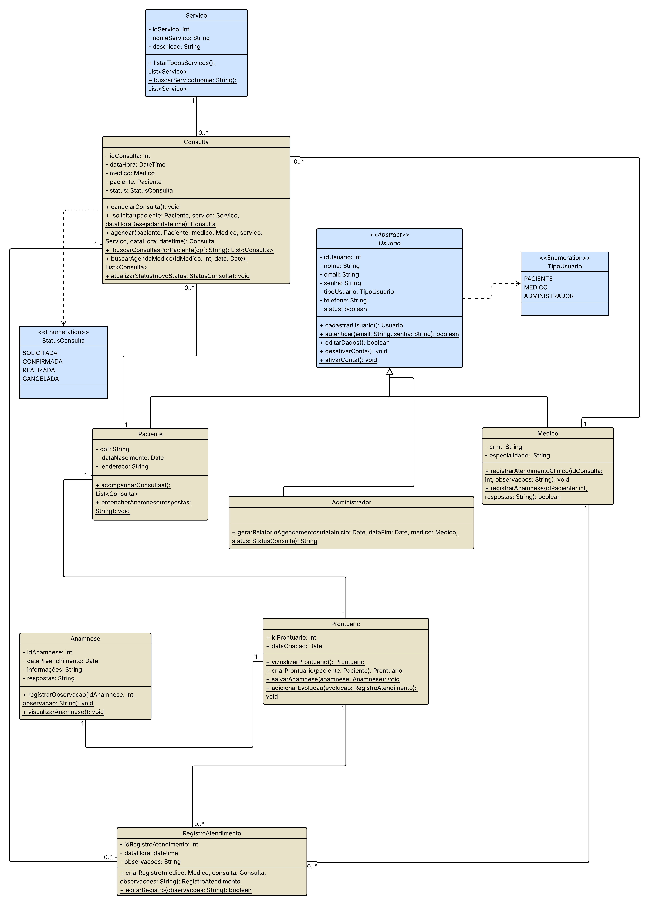

Dental Clinic
# Sistema de Clínica Odontológica

Modernizando a gestão odontológica: Mais agilidade no atendimento, segurança nos dados e eficiência para profissionais e pacientes.

## Sobre o Projeto

O Sistema de Clínica Odontológica é uma aplicação web Full Stack desenvolvida para centralizar e automatizar o gerenciamento de uma clínica. A proposta surge da necessidade de substituir processos manuais e planilhas por uma solução integrada que acompanha todo o ciclo de atendimento.

## Visão do Produto

Ao contrário de métodos manuais, nosso sistema permite que administradores, dentistas e pacientes interajam em uma plataforma única, garantindo que o histórico clínico, agendamentos e cadastros estejam sempre seguros e acessíveis.

## Objetivos de Negócio

| Objetivo | Descrição |
|----------|-----------|
| Eficiência | Reduzir o tempo médio de agendamento e registro em 50%. |
| Produtividade | Aumentar em 30% a produtividade dos profissionais através da automação de históricos. |
| Segurança | Centralização segura de dados clínicos e cadastrais. |

## Tecnologias Utilizadas

O projeto foi modernizado utilizando uma arquitetura robusta e escalável.

### Frontend (Client-side)

- React.js: Interfaces dinâmicas
- Tailwind CSS: Estilização responsiva
- JavaScript (ES6+) / JSX: Lógica e componentes
- Axios: Consumo da API REST

### Backend (Server-side)

- Java 17+: Linguagem base
- Spring Boot: API RESTful
- Spring Data JPA: Persistência de dados
- Spring Security: Controle de autenticação
- Maven: Gerenciamento de dependências

### Banco de Dados & Ferramentas

- MySQL: Banco de dados relacional
- Git & GitHub: Versionamento
- Figma: Prototipação
- Trello: Gestão ágil (Kanban)

## Funcionalidades Principais

O sistema atende a três perfis de usuários: Administrador, Médico e Paciente.

- **Gestão de Acesso**: Autenticação, recuperação de senha e perfis de usuário
- **Agendamentos**: Marcação, visualização de agenda e gestão de status (Confirmada/Realizada)
- **Prontuário Eletrônico**: Histórico clínico, Anamnese e Evolução do paciente
- **Administrativo**: Cadastro de serviços, profissionais e relatórios de atendimento

## Modelagem e Arquitetura

O sistema foi modelado seguindo os princípios da Orientação a Objetos. Abaixo está o Diagrama de Classes que representa a estrutura principal da aplicação.

---


---
## Equipe de Desenvolvimento

| Integrante | Papel |
|-----------|-------|
| Jéssica Isabela Cardoso de Castro | Full Stack Developer |
| José Kayque Lima Lopes | Full Stack Developer |
| Kayc Henderson Morais Leite | Full Stack Developer |
| Letícia Vieira Gonçalves | Full Stack Developer |
| Maria Isabelly Lima de Souza | Full Stack Developer |

## Como Executar o Projeto

Para rodar o projeto localmente, você precisará de duas instâncias de terminal: uma para o Backend e outra para o Frontend.

### Pré-requisitos

- Java JDK 17 ou superior
- Node.js e npm
- MySQL rodando localmente
- Maven (opcional, wrapper incluso)

### 1. Configuração do Banco de Dados (MySQL)

Execute o script abaixo no seu cliente MySQL para criar o banco e as tabelas:

```sql
CREATE DATABASE IF NOT EXISTS dentalclinicdb;
USE dentalclinicdb;

-- ===================================================
-- LIMPEZA GERAL
-- ===================================================
SET FOREIGN_KEY_CHECKS = 0;
DROP TABLE IF EXISTS registro_atendimento;
DROP TABLE IF EXISTS consulta;
DROP TABLE IF EXISTS prontuario;
DROP TABLE IF EXISTS anamnese;
DROP TABLE IF EXISTS servico;
DROP TABLE IF EXISTS usuario;
SET FOREIGN_KEY_CHECKS = 1;

-- ===================================================
-- CRIAÇÃO DAS TABELAS
-- ===================================================

CREATE TABLE usuario (
    id_usuario INT PRIMARY KEY AUTO_INCREMENT,
    nome VARCHAR(255) NOT NULL,
    email VARCHAR(255) NOT NULL UNIQUE,
    senha VARCHAR(255) NOT NULL,
    tipo_usuario ENUM('PACIENTE', 'MEDICO', 'ADMINISTRADOR') NOT NULL,
    tipo_usuario_db VARCHAR(31), 
    telefone VARCHAR(20),
    stats BOOLEAN DEFAULT TRUE,
    cpf VARCHAR(15) UNIQUE,
    data_nascimento DATE,
    endereco VARCHAR(255),
    crm VARCHAR(50) UNIQUE,
    especialidade VARCHAR(100)
) ENGINE=InnoDB;

CREATE TABLE servico (
    id_servico INT AUTO_INCREMENT PRIMARY KEY,
    nome_servico VARCHAR(255) NOT NULL,
    descricao TEXT
) ENGINE=InnoDB;

CREATE TABLE anamnese (
    id_anamnese INT PRIMARY KEY AUTO_INCREMENT,
    data_preenchimento DATE,
    informacoes TEXT,
    respostas TEXT,
    id_paciente INT NOT NULL,
    FOREIGN KEY (id_paciente) REFERENCES usuario(id_usuario)
) ENGINE=InnoDB;

CREATE TABLE prontuario (
    id_prontuario INT PRIMARY KEY AUTO_INCREMENT,
    data_criacao DATE,
    id_paciente INT NOT NULL UNIQUE,
    id_anamnese INT UNIQUE,
    FOREIGN KEY (id_paciente) REFERENCES usuario(id_usuario),
    FOREIGN KEY (id_anamnese) REFERENCES anamnese(id_anamnese)
) ENGINE=InnoDB;

CREATE TABLE consulta (
    id_consulta INT PRIMARY KEY AUTO_INCREMENT,
    data_hora DATETIME NOT NULL,
    stats ENUM('SOLICITADA', 'CONFIRMADA', 'REALIZADA', 'CANCELADA') DEFAULT 'SOLICITADA',
    id_paciente INT NOT NULL,
    id_medico INT NOT NULL,
    id_servico INT NOT NULL,
    FOREIGN KEY (id_paciente) REFERENCES usuario(id_usuario),
    FOREIGN KEY (id_medico) REFERENCES usuario(id_usuario),
    FOREIGN KEY (id_servico) REFERENCES servico(id_servico)
) ENGINE=InnoDB;

CREATE TABLE registro_atendimento (
    id_registro_atendimento INT PRIMARY KEY AUTO_INCREMENT,
    data_hora DATETIME NOT NULL,
    observacoes TEXT,
    id_prontuario INT NOT NULL,
    id_medico INT NOT NULL,
    id_consulta INT NOT NULL,
    FOREIGN KEY (id_prontuario) REFERENCES prontuario(id_prontuario),
    FOREIGN KEY (id_medico) REFERENCES usuario(id_usuario),
    FOREIGN KEY (id_consulta) REFERENCES consulta(id_consulta)
) ENGINE=InnoDB;
```

> **Importante**: Verifique se o arquivo `src/main/resources/application.properties` no Backend está configurado com seu usuário e senha do MySQL.

### 2. Rodando o Backend (Spring Boot)

```bash
cd backend

# Instalar dependências (Windows)
./mvnw.cmd clean install
# Ou no Linux/Mac
./mvnw clean install

# Executar a aplicação (Windows)
./mvnw.cmd spring-boot:run
# Ou no Linux/Mac
./mvnw spring-boot:run
```

O servidor iniciará na porta 8080.

### 3. Rodando o Frontend (React)

```bash
cd frontend

# Instalar dependências
npm install

# Rodar servidor de desenvolvimento
npm run dev
```

Acesse a aplicação em `http://localhost:5173` (ou a porta indicada no terminal).

## Estrutura de Pastas

```
/
├── backend/            # Código Fonte Java/Spring Boot
│   ├── src/main/java   # Controllers, Models, Repositories
│   └── pom.xml         # Dependências Maven
│
├── frontend/           # Código Fonte React
│   ├── src/
│   │   ├── components/ # Componentes Reutilizáveis
│   │   ├── pages/      # Páginas do Sistema
│   │   ├── App.jsx     # Componente Principal
│   │   └── main.jsx    # Ponto de entrada React
│   ├── public/
│   └── tailwind.config.js
│
└── README.md           # Documentação do Projeto
```

## Equipe de Desenvolvimento

<table align="center">
  <tr>    
    <td align="center">
      <a href="https://github.com/Leticiavieirg">
        <br>
        <sub>
          <b>Letícia Vieira</b>
         </sub>
      </a>
    </td>
    <td align="center">
      <a href="https://github.com/">
        <br>
        <sub>
          <b>Jose Kayque</b>
         </sub>
      </a>
    </td>
    <td align="center">
      <a href="https://github.com/">
        <br>
        <sub>
          <b>Kayc Henderson</b>
         </sub>
      </a>
    </td>
    </td>
    <td align="center">
      <a href="https://github.com/isabellylimals">
        <br>
        <sub>
          <b>Maria Isabelly</b>
         </sub>
      </a>
    </td>
    </td>
    <td align="center">
      <a href="https://github.com/isabellylimals">
        <br>
        <sub>
          <b>Jessica Isabela</b>
         </sub>
      </a>
    </td>
  
  </tr>
</table>


## Licença

Este projeto foi desenvolvido para fins acadêmicos.
